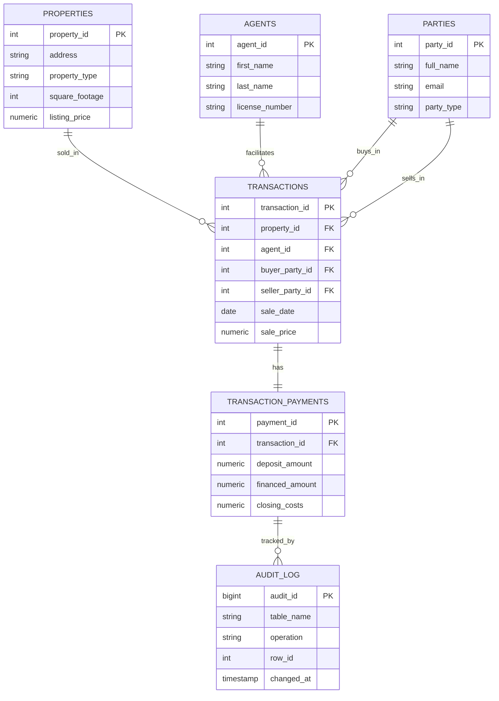

# Distributed Sales Log Query Optimization & Auditing Engine

A two-database (PostgreSQL + MySQL) performance audit and security-logging project built on a synthetic real estate transactions dataset (~50,000 transactions). Demonstrates the full lifecycle of diagnosing and fixing slow queries — execution plan analysis, strategic indexing, query restructuring — plus a trigger-based audit logging engine for sensitive financial tables.

## What this project demonstrates

- **Relational database design (3NF)** — a normalized schema with a unified `parties` table (buyers/sellers as roles, not separate entity types) deployed identically across PostgreSQL and MySQL
- **ETL pipeline (Python + Pandas)** — synthetic data generation with realistic skew (top-performing agents, recent-activity bias), validation, and bulk loading into both databases
- **SQL query optimization** — `EXPLAIN ANALYZE` execution plan analysis on a deliberately unindexed baseline, identifying full table scans as the root bottleneck
- **Indexing & query restructuring** — targeted indexes justified by specific query patterns (not blanket indexing), plus an `OR`-to-`UNION ALL` rewrite for a case indexing alone can't fix
- **Measured performance improvement** — a Python benchmark harness producing real, reproducible before/after timing data (see `optimization/results/`)
- **Stored procedures & triggers** — an audit logging engine capturing every INSERT/UPDATE/DELETE on the sensitive `transaction_payments` table
- **Git** — version-controlled throughout

## Entity Relationship Diagram



### Design note: why `parties` instead of separate `buyers`/`sellers` tables

A buyer and a seller are the same kind of real-world entity — a person or company capable of transacting — and the same party can be a buyer in one deal and a seller in another. Modeling them as two separate tables would duplicate identity data and break the moment one person played both roles. Instead, `parties` holds identity data once, and `transactions` references it twice (`buyer_party_id`, `seller_party_id`) — the role lives on the transaction, not on the person. This is a direct application of 3NF: don't store the same fact (a person's identity) in more than one place.

## Project structure

```
sales-log-query-optimization/
├── schema/
│   ├── postgres/      # Unindexed baseline schema (PostgreSQL)
│   └── mysql/          # Unindexed baseline schema (MySQL)
├── etl/
│   ├── generate_data.py    # Synthetic data generation (extract/transform)
│   ├── load_data.py          # Bulk load into both databases
│   └── requirements.txt
├── data/                       # Generated CSVs (gitignored if large; see Setup)
├── optimization/
│   ├── before/                  # Slow queries against unindexed baseline
│   ├── after/                    # Indexes + restructured queries
│   ├── benchmark.py             # Before/after timing harness
│   └── results/                   # before_benchmark.json / after_benchmark.json
├── audit/
│   ├── postgres/                  # Audit log table + triggers (PostgreSQL)
│   ├── mysql/                       # Audit log table + triggers (MySQL)
│   └── demo_audit.sql                 # Proves the audit engine works
└── README.md
```

## Setup

Requires PostgreSQL, MySQL, and Python 3.10+.

### 1. Create the databases

```sql
-- PostgreSQL
CREATE DATABASE sales_log;

-- MySQL
CREATE DATABASE sales_log;
```

### 2. Build the unindexed baseline schema

```bash
# PostgreSQL (from inside psql, connected to sales_log)
\i schema/postgres/run_all_schema.sql

# MySQL (from inside the mysql shell, connected to sales_log)
SOURCE schema/mysql/run_all_schema.sql;
```

### 3. Generate and load data

```bash
cd etl
pip install -r requirements.txt
python generate_data.py
# Edit PG_CONN_STRING / MYSQL_CONN_STRING in load_data.py with your local credentials
python load_data.py --target both
```

### 4. Run the "before" audit

```bash
# Inside psql / mysql shell, run each query in optimization/before/*.sql
# individually and observe the execution plans (look for Seq Scan / full
# table scans on the transactions table).
```

### 5. Benchmark before optimization

```bash
cd optimization
python benchmark.py --phase before
```

### 6. Apply indexes and restructured queries

```bash
\i optimization/after/postgres_add_indexes.sql      -- PostgreSQL
SOURCE optimization/after/mysql_add_indexes.sql;     -- MySQL
```

### 7. Benchmark after optimization

```bash
python benchmark.py --phase after
```

This prints a before/after comparison and an overall latency reduction percentage, backed by `optimization/results/before_benchmark.json` and `after_benchmark.json`.

### 8. Install the audit logging engine

```bash
\i audit/postgres/run_all_audit.sql      -- PostgreSQL
SOURCE audit/mysql/run_all_audit.sql;     -- MySQL
```

### 9. Prove the audit engine works

Run `audit/demo_audit.sql` statement-by-statement and inspect `audit_log` after each mutation.

## Key technical decisions

**Why generate synthetic data instead of using a public dataset?** Real estate transaction data with buyer/seller financials is sensitive and rarely available publicly at the volume (50k+ rows) needed to produce genuinely measurable query slowdowns. Generation also allows deliberate, realistic skew (a small number of agents handling a disproportionate share of deals, recent activity outweighing older activity) — uniform random data understates how much indexes help on real, unevenly-distributed data.

**Why two databases?** PostgreSQL and MySQL handle several relevant things differently — most notably, InnoDB (MySQL) auto-indexes foreign key columns, while PostgreSQL does not. Running the same audit-and-fix process on both surfaces this difference directly rather than asserting it.

**Why `UNION ALL` instead of `OR` for the buyer-or-seller query?** A single B-tree index can't efficiently serve `WHERE col_a = X OR col_b = X` across two different columns — most query planners fall back to a full scan. Splitting into two indexed single-column lookups combined with `UNION ALL` lets each half use its own index. `UNION ALL` (not `UNION`) avoids an unnecessary deduplication pass, since the `buyer_party_id <> seller_party_id` CHECK constraint already guarantees no overlap between the two result sets.

**Why JSON columns in `audit_log` instead of one column per tracked field?** A fixed-column audit table breaks the moment the tracked table's schema changes. Storing the full row as JSON (`JSONB` in Postgres, `JSON` in MySQL) makes the audit log schema-agnostic, at the cost of harder querying into individual fields — a deliberate, documented trade-off.

## Tech stack

PostgreSQL · MySQL (InnoDB) · Python (Pandas, SQLAlchemy) · PL/pgSQL & MySQL stored procedures/triggers · SQL DDL/DML
